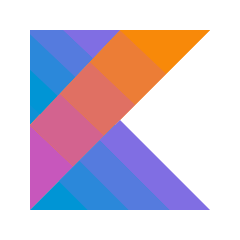
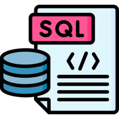

<h1 align="left">hola!!👋 </h1>

###

Mi nombre es Paula Arroyo y soy una desarrolladora Android que se encuentra en la busqueda de nuevos desafíos en el mundo de la tecnología.

###

<h2 align="left">Sobre mí</h2>

###

✨ En octubre del año 2023 finalicé el bootcamp de Desarrollo de Aplicaciones Móviles Android Traine, en la Academia Desafío Latam.   📚 En la actualidad me especializo en el desarrollo de aplicaciones Android 🎯 Metas: Consolidarme como una desarrolladora Android  🎲 Intereses: Senderismo, teatro 

###

<h2 align="left">I code with</h2>

###

  
  
  
  
  
  
  
  

###